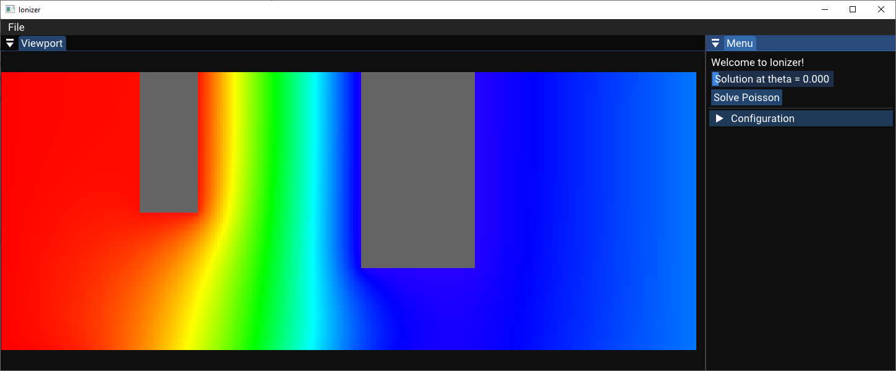

I'm a senior mechanical engineering student at Bogazici University.

As a fun exercise, I decided to build this webpage with [Tailwindcss](https://tailwindcss.com/) and [Gatsby](https://www.gatsbyjs.com/).

In the [Projects](/projects) section, you can find brief reports of projects I have been involved in.

---

## About Ionizer

In the spring of 2022, I started to work on an ion truster simulation program (**Ionizer**) at [Bogazici University Space Technologies Laboratory](http://bustlab.boun.edu.tr/).

It's a tricky simulation because the applicability of the continuum assumption is questionable since the operating pressures are pretty low. Therefore, the molecular theory has to be employed.

Ionizer is being written in C++, and its goal is to solve the 3D [Poisson's equation](https://en.wikipedia.org/wiki/Poisson%27s_equation) to calculate the electrostatic field inside the thruster and move the ions accordingly with the well-established molecular approach, PIC-DSMC.

To check out the repository and contribute on Github, click [here](https://github.com/sinaatalay/Ionizer).

Currently, it solves 3D Poisson's equation for the potential field, which is how it looks:

---

## About My YouTube Channel

In June 2020, I instructed the entire _Engineering Mechanics: Dynamics_ course on YouTube, which has so far received more than 200,000 views. You can see two of my videos below.

<iframe
    width="100%"
    height="100%"
    src="https://www.youtube-nocookie.com/embed/KWa4V1s4yug"
    title="YouTube video player"
    frameborder="0"
    allowfullscreen
></iframe>

    <iframe
    width="100%"
    height="100%"
    src="https://www.youtube-nocookie.com/embed/perz7qJG7qc"
    title="YouTube video player"
    frameborder="0"
    allowfullscreen
    ></iframe>

