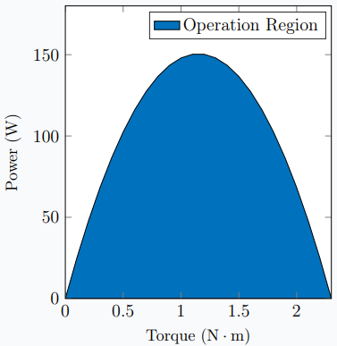
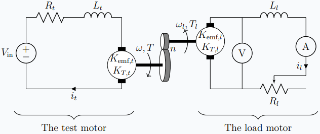
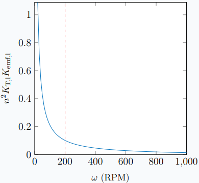
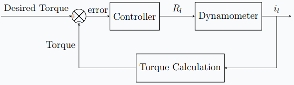
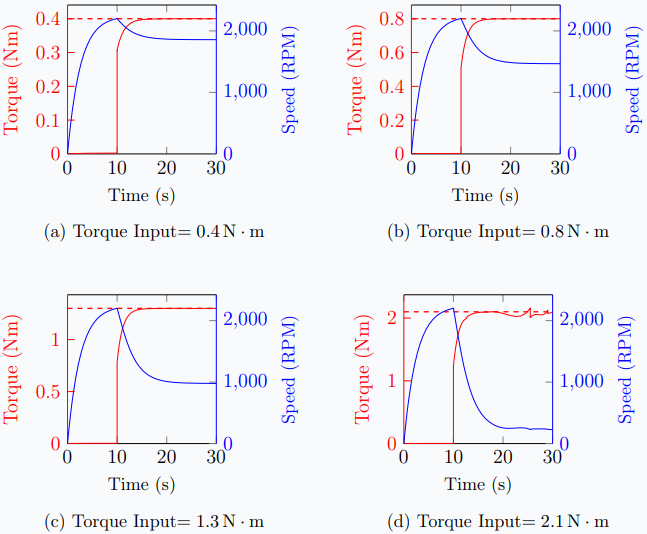

## Introduction

### What is a dynamometer, and why is it important?

An **absorption dynamometer**, also known as a "**dyno**", is a device that measures the instantaneous rotational speed and torque of an engine, motor, or any rotating prime mover while acting as a load. A **motoring dynamometer** is a device that measures the required rotational speed and torque to operate a driven device (such as a pump) while acting as a prime mover. This report covers an absorption dynamometer design. The absorption dynamometer is referred to as the dynamometer throughout the report.

A dynamometer is a helpful tool to analyze a motor's characteristics before using it on real systems. Those characteristics can help accurately compare the motor's performance with other options.

Motor suppliers usually provide torque vs. speed, power, and current curves; however, it may not always be reliable. Moreover, the specifications of old motors may be unknown. However, with a dynamometer, the required measurements can be made.

### Need

A dynamometer is a valuable tool for any mechanical engineering laboratory. The current dynamometer used in the mechanical engineering lab at Bogazici University's Kilyos Campus is wanted to be further improved with different energy dissipating methods. Therefore, a new dynamometer needs to be designed and constructed.

### Problem Statement and General Specifications

A low-cost small dynamometer will be designed to use in engineering labs. A specific DC Motor, **BOSCH GPG (3 137 230 306)**, will be assumed to be the **test motor**, and the dynamometer is expected to work for this motor. The test motor's performance curves are shown in Figure 1. The maximum power output, stall torque, and the motor's top speed are $150\text{ W}$, $2.3\text{ Nm}$, and $2500 \text{ RPM}$ [1]. The recommended voltage at which the motor should be operated is $12 \text{V}$.

![Performance curves of BOSCH GPG (3 137 230 306) [1]](MotorCurves.png)

The design criteria dictate that the dynamometer should operate in the region shown in Figure 2. The test motor's power vs. torque diagram sets the limit and is not expected to be exceeded.

In general, four questions should be answered to design the dynamometer.

1.  What type of absorption unit will be used?
2.  What device will be used for torque measurement?
3.  What device will be used for rotation speed measurement?
4.  Will speed, torque, or both be controlled?

## Absorption Unit Selection

Dynamometers measure the torque and power by applying a load to the test motor. They accomplish this by using various methods to absorb the energy output. For example, the energy can be absorbed with a mechanical friction brake, hydraulic brake, eddy current brake, etc. Another method is to use another DC motor, **the load motor**, and couple it with the test motor. This type of dynamometer is generally called an **electric dynamometer**, and this report covers its design [2].

Before the decision, the available methods are researched and discussed. Then, the decision is made considering the limitations of our time, money, technology, and design criteria. This section briefly explains the researched absorption units and the reason behind the decision.

### Mechanical Friction Brake

Some dynamometers absorb energy in a mechanical friction brake. The easiest way to build a dynamometer with this method is to use a **prony brake**, as shown in Figure 3. A prony brake both absorbs the motor's energy output and measures the torque produced. Moreover, it is a very simple device to build.

![Schmetic diagram of a prony brake [3].](PronyBrake.png)

As shown in Figure 3, a lever is clamped to the shaft, and load F is measured. The load F is only carried by the frictional force between the shaft and the lever since the lever is only supported by the shaft and the load F. Then, by using statics, it can be shown that $M=Fl$. There are two primary methods to measure F, using a weight or a load cell.

Even though a prony brake is an affordable and convenient device, it is inflexible and hard to control. Either the weights or the clamping force must be changed to control the load; both are very hard to control electronically. Another disadvantage is that frictional braking causes brake pad wear, so that a regular replacement might be required.

### Eddy Current Brake

When a piece of metal moves through a magnetic field, circulating currents called eddy currents are generated in the metal. According to Lenz's law, the generated eddy currents create opposing magnetic fields, which gives rise to a repulsive force that resists the motion of the metal [4]. Many braking systems make use of this phenomenon.

In its simplest form, an eddy current dynamometer uses a metal disk attached to a shaft and a magnetic field of controlled strength, as shown in Figure 4. Eddy currents are induced in the rotating disk, which results in braking. This is an example of an **eddy current brake**. The strength of braking depends on the magnitude of the magnetic field. The magnetic field's magnitude can be adjusted by moving the magnet or increasing the current passing through an electromagnet. The energy from the eddy currents is absorbed in the disk and transformed into heat.

![Schematic diagram of a eddy current brake [3].](EddyCurrentBrake.png)

Even though eddy current braking absorbs the motor's energy, the torque measurement is not as straightforward as the prony brake. Moreover, building a well-balanced disk coupled to the shaft is not easy. However, the load might be controlled electronically with an electromagnet, unlike the prony brake.

### Dynamic Brake

A **dynamic brake** uses an electric motor as a generator to produce an opposing torque that resists the motion. One of the most used types of dynamometers is an electric dynamometer. In an electric dynamometer, the test motor's shaft is coupled to a generator so that the test motor's energy is absorbed with electrical output from the generator. The generated electrical power can be dissipated as heat with a resistor or returned to the supply line.

This type of dynamometer offers many advantages like

- A DC motor is a very accessible device that is ready to operate as a generator.
- A dynamic braking system's lifespan is longer than a frictional braking system's since there is no wear problem.
- Suppose a DC motor is used as a generator. In that case, the torque can be easily found by measuring the current flows through the generator since DC motors exhibit a linear relationship between torque and current.
- The load can be easily changed by adjusting the resistance connected to the generator output with a digital potentiometer.
- The dynamometer could be further improved to turn the absorbed energy into useful work that would otherwise be lost as heat.
- The absorber dynamometer might be modified to operate in reverse as a motoring dynamometer.

The main disadvantage of dynamic braking is that the braking torque is linearly proportional to the rotation speed. Therefore, it is very difficult to brake the motor at low speeds. The details will be discussed in Section 3.

### The Decision

The eddy current brake option was rejected after considering our time and budget limitations. It was the hardest one to build and maintain among our options, and it did not offer advantages that the others could not.

We collected more detailed information about prony brakes and dynamic brakes. Then, we found and reviewed their implementations on the internet, such as shown in Figure 5.

![A small prony brake dynamometer [6].](PronyBrakeYoutube.png)

In conclusion, we decided to use another DC motor as a generator for braking and design an electric dynamometer. Its ease of use and many advantages, such as being electronically controllable and being open to further modifications, made this option more beneficial than a prony brake dynamometer.

## Dynamic Brake with Another DC Motor

An electric motor is used as a generator to apply a load to the test motor in electric dynamometers. Because of its simplicity, a DC motor is used as a generator and called the load motor in the report. To understand how the load motor generates a torque that resists motion, we should look into the basics of a DC motor.

### The Basics of a DC Motor

A basic DC motor model is shown in Figure 6. Faraday's law of induction states that; as the coil rotates, the changing magnetic flux induces a voltage difference between terminals [4]. This voltage difference, called the **emf** (electromotive force), is shown in Equation 1.

$$

\text{emf}=K_\text{emf}\omega \tag{1}

$$

where $K_\text{emf}$ is the emf constant of the motor, $\omega$ is the angular speed of the shaft, and emf is the induced voltage difference between terminals [7].

![Schmetic diagram of a DC motor [8].](DCMotor.png)

When a current is run through the coil, a magnetic torque is exerted on the rotor. The generated torque can be shown as

$$

T=K_\text{T} i \tag{2}

$$

where $K_\text{T}$ is the torque constant of the motor, $i$ is the coil current, and $T$ is the generated torque [7].

When a DC motor's rotor starts being rotated, it generates emf, and when the motor's terminals are connected, this EMF causes a current to flow. This current, in turn, generates a torque that resists motion according to Lenz's Law [4]. The dynamometer's load motor will operate on this fundamental principle.

### Formulation and Design Variables

To further understand the dynamometer's design, its schematic is shown in Figure 7.

When the test motor starts to rotate, the load motor will rotate. This rotation will generate a voltage difference between the load motor's terminals, and current $i_l$ will start to flow. The current $i_l$ will cause braking.

The schematic, shown in Figure 7, completes the formulation of the design.

- $V_\text{in}$ is the test motor's voltage input.
- $R_t$ is the internal resistance of the test motor.
- $L_t$ is the internal inductance of the test motor.
- $K_\text{emf,t}$ is the back emf constant of the test motor.
- $K_\text{T,t}$ is the torque constant of the test motor.
- $i_t$ is the current that flows through the test motor.
- $\omega$ is the rotation speed of the test motor.
- $T$ is the torque of the test motor.
- $n$ is the gear ratio.
- $R_t$ is the internal resistance of the load motor plus the potentiometer's resistance.
- $L_l$ is the internal inductance of the load motor.
- $K_\text{emf,l}$ is the back emf constant of the load motor.
- $K_\text{T,l}$ is the torque constant of the load motor.
- $i_l$ is the current that flows through the load motor.

The fundamental independent **design variables** are

- $n$: gear ratio selection
- $K_\text{emf,l}$, $K_\text{T,l}$, $L_l$: the load motor selection
- $R_\text{l}$: the potentiometer selection

We will analyze the system to choose the best design variables to achieve the targets bound to the constraints. **Targets** and **constraints** are

- The dynamometer must be able to measure the instantaneous rotation speed and torque of small motors in the region shown in Figure 2.
- The load should be able to be controlled.
- The dynamometer should be cheaper than $250.

### Selecting the Load Motor and Gear Ratio

For the load motor and gear ratio selection, we will assume that the system is in a steady-state ($\dot{i_l}=0$) so that $L_l$ will not affect the equations. Using Kirchhoff's voltage law [9] and Equation 1, it can be shown that

$$

i_lR_l-n\omega K_\text{emf,l}=0 \tag{3}

$$

Next, using Equation 2 for the load motor yields.

$$

\frac{T}{n}=i_lK_\text{T,l} \tag{4}

$$

Combining Equation 3 and Equation 4 yields

$$

\frac{T}{\omega}=\frac{\omega n^2 K_\text{T,l} K_\text{emf,l}}{R_l} \tag{5}

$$

Equation 5 shows that as $R_l$ approaches $0$, $T/\omega$ approaches $\infty$, which practically means it would be impossible to rotate the load motor's shaft if $R_l$ were equal to $0$. However, every motor has an internal resistance, which will set the maximum torque for a given $\omega$ value. Therefore, we will later substitute a conservative value of $1\text{ }\Omega$ for $R_l$, which is generally a very high internal resistance for DC motors.

The left-hand side of Equation 5 does not depend on our design but on the motor being tested. Since the selected test motor is the design's limitation, the data shown in Figure 1 is substituted for $T/\omega$. The interesting point is that as $T$ increases, $\omega$ decreases for any DC motor. This is the disadvantage of dynamic braking, as pointed out in Subsection 2.3, which is that it is very difficult to brake a motor that rotates slowly. Because of this reason, we will select a minimum rotation speed for our dynamometer. However, it is not a big problem since measuring static and low-speed loads is easy, and a dynamometer is fundamentally not a static measurement device.

By reading Figure 1, it is found that

$$

T( \omega)=2.3 - 0.00879\omega \tag{6}

$$

where $T$ is in $\text{Nm}$ and $\omega$ is in $\text{rad}/\text{s}$. Dividing both sides with $\omega$ and multiplying with $R_l=1\text{ }\Omega$ yields

$$

\frac{TR_l}{\omega}=-0.00879+ \frac{2.3}{\omega} \tag{7}

$$

Combining Equation 5 and Equation 7 yields

$$

nK_\text{T,l}K_\text{emf,l}=-0.00879+ \frac{2.3}{\omega} \tag{8}

$$

In Figure 8, Equation 8 is plotted.

The bigger the $n^2K_\text{l}K_\text{emf,l}$ value, the harder it is to find an appropriate DC motor and a reduction drive. Therefore we will limit ourselves with a minimum rotation speed. After considering the standard motor constants of motors in the market, the following values are chosen.

- The minimum operating speed of the dynamometer: $200$ RPM
- $n^2K_\text{T,l}K_\text{emf,l}=0.101$ (In SI units)

Considering the results, **BOSCH AHC1 (0 390 203 386)** is selected as the load motor. Moreover, the motor has a reduction drive. The load motor's properties are

- $n=50$
- $K_\text{T, l}\approx 0.011\text{ Nm}/\text{A}$
- $K_\text{emf, l}\approx 0.011\text{ Vrad}/\text{s}$
- $n^2K_\text{emf,l}K_\text{T,l}=0.302 \text{ VradNm}/\text{sA}$

and performance curves are shown in Figure 9 [1].

![Performance curves of BOSCH AHC1 (0 390 203 386) [1].](LoadMotorCurves.png)

### Selecting the Potentiometer

The potentiometer's maximum value will only affect the lowest load that can be produced. The higher the range, the better the dynamometer. Using Equation 5, it can be seen that for $R_l>10000\text{ }\Omega$, the braking torque will be significantly low. Fortunately, digital potentiometers up to $10000\text{ }\Omega$ can easily be found in the market.

## Control, Measurement, and Calibration

### Measuring the Load

The load on the load motor's shaft is directly proportional to the current that runs through the load motor's coil, as shown in Equation 2. The current can be measured with the amperemeter shown in Figure 7, and then the torque of the test motor $T$ can be calculated using Equation 2. The torque constant of the load motor $K_\text{T,l}$ needs to be known for this calculation. Since the load motor will be a permanent part of the system, its characteristics will be measured and calibrated beforehand.

### Controlling the Load

The load can be controlled because $i_l$ can be controlled with a digital potentiometer shown as $R_l$ in Figure 7. This potentiometer will be connected to a microcontroller, and a PID control mechanism will be implemented to get the desired load. The block diagram of this control scheme is shown in Figure 10.

### Measuring the Speed

The rotation speed of the load motor's shaft is related to the voltage difference between the terminals, as shown in Equation 1. The voltage difference can be measured with the amperemeter shown in Figure 7. Then the rotation speed of the test motor $\omega$ can be calculated using Equation 1 and $\omega=\omega_l n$. The back emf constant of the load motor $K_\text{emf,l}$ needs to be known for this calculation. Again, because the load motor will be a permanent part of the system, its characteristics will be measured and calibrated beforehand.

### Calibration

The dynamometer needs to be calibrated because the torque and the speed are not measured directly but with a voltmeter and an amperemeter. Thankfully, Equation 1 and Equation 2 are linear equations, and the calibration is just a matter of linear curve fitting. So all that needs to be done for torque calibration is to apply a static load to the load motor beforehand and read the current for at least eight different loads, then find the best $K_\text{T,l}$ that fits the data. The same goes for the speed measurement too. Again, find the best $K_\text{emf,l}$ that fits the data.

For calibration, another dynamometer can be used. Even though it seems bizarre to build a dynamometer using another dynamometer, it should not be a problem because it is only a one-time process.

## Modeling and Simulation

As discussed in the previous section, the dynamometer will be controlled with a microcontroller to achieve the desired torque. To further analyze, improve, and optimize the dynamometer and the design, the system is modeled mathematically. Then the closed-loop response is simulated with MATLAB for different desired torque inputs.

A good presentation of the modeling process and its outcomes is shown in Figure 11.

![The modeling process [10].](Model.png)

### Modeling the Dynamometer

Figure 7 should be examined closely to model the dynamometer mathematically. The system's mathematical model is constructed using fundamental principles to simulate the system.

Using Kirchhoff's voltage law and Equation 1, it can be shown that

$$

V_\text{in}-R_ti_t-L_t\dot{i_t}-\omega K_\text{emf,t}=0 \tag{9}

$$

$$

R_li_l-L_l\dot{i_l}-n\omega K_\text{emf,l}=0 \tag{10}

$$

Then assuming the gearbox has rotational inertia of $I$ and viscous damping of $c$, the torque balance equation yields

$$

i_tK_\text{T,t}-I\dot{\omega}-c\omega-ni_l K_\text{T,l}=0 \tag{11}

$$

Combining Equation 9, Equation 10, and Equation 11 and representing them in state-space formulation results

$$

\left\lbrack \begin{matrix} \dot{i_t } \\ \dot{\omega} \\ \dot{i_l } \end{matrix}\right\rbrack =\left\lbrack \begin{matrix} {-R}_t/L_t & {-K}_{\text{emf},t}/L_t & 0\\ K_{T,t} /I & -c/I & -{nK}_{T,l} /I\\ 0 & {nK}_{\text{emf},l} /L_l & {-R}_l(t) /L_l \end{matrix}\right\rbrack \left\lbrack \begin{matrix} i_t \\ \omega \\ i_l \end{matrix}\right\rbrack +\left\lbrack \begin{matrix} 1/L_t \\ 0\\ 0 \end{matrix}\right\rbrack \left\lbrack \begin{matrix} V_{\text{in}} \end{matrix}\right\rbrack \tag{12}

$$

### Simulating the Dynamometer

As seen in Equation 12, the system is a linear **time-variant** system because $R_l$ can change. With traditional methods and libraries of MATLAB, the system could not be simulated because $R_l$ is not exactly an input but rather a property of the system. Therefore, the response of the closed-loop system, shown in Figure 10, is simulated with an ordinary differential equation solver of MATLAB. The code is given in [here](https://github.com/sinaatalay/DynamometerSimulation).

Via a trial-and-error process of repetitive analysis, the most satisfactory PID tuning is found to be

- $K_p=10000$
- $K_d=0$
- $K_i=10000$

In the simulation, at $t=0$, the test motor starts running and $R_l$ is kept $\infty$. At $t= 10 \text{ s}$ PID control starts and $R_l$ starts to being adjusted accordingly. In Figure 12, different responses with different desired torque inputs are shown.

## Conclusion

In this project, an electric absorption dynamometer is designed, modeled, and simulated to build in the fall of 2022. The design will be used in the mechanical engineering laboratories of Boğaziç University for small DC motors.

Firstly, we researched and learned how a dynamometer works. Then we selected an absorption unit which is a DC generator. After the absorption unit selection, we formulated the dynamometer carefully and designed the system to achieve our targets bound to our constraints. Next, we modeled the system mathematically and simulated it to understand further if the design works fine. Finally, we designed the mechanical structure and analyzed the project's total cost (even though this part is not included on the site).

<h2 class="nocount">References</h2>

1. BOSCH, Electric Motors Catalogue, 2021-2022.
2. W. W. Pulkrabek, Engineering Fundamentals of the Internal Combustion Engine. USA: Prentice Hall, 1997, ISBN: 9780135708545.
3. MatthiasDD. “Schematic of a prony brake.”, [Online]. Available: [Click here](https://commons.wikimedia.org/wiki/File:Prony_brake.svg) (visited on 05/07/022).
4. R. A. Serway and J. John W. Jewett, Physics for Scientists and Engineers with Modern Physics. USA: Cengage Learning, 2014, ISBN: 9781133954057.
5. Chetvorno. “Eddy current brake diagram.”, [Online]. Available: [Click here](https://en.wikipedia.org/wiki/File:Eddy_current_brake_diagram.svg) (visited on 05/07/022).
6. JohnnyQ90. “Simplest dyno for rc engines! - prony brake dynamometer!”, [Online]. Available: [Click here](https://youtu.be/0ESOYhOh28c) (visited on 05/19/2022).
7. N. S. Nise, Control Systems Engineering. USA: Wiley, 2019, ISBN: 9781119474210.
8. Nagwa. “Lesson explainer: Direct current motors.”, [Online]. Available: [Click here](https://www.nagwa.com/en/explainers/246108560531) (visited on 05/08/2022).
9. J. W. Nilsson and S. A. Riedel, Electric Circuits. USA: Pearson Education, 2014, ISBN: 9780133594812.
10. A. B. Downey, Physical Modeling in MATLAB. USA, 2022. [Online]. Available: [Click here](https://greenteapress.com/wp/physical-modeling-inmatlab/) (visited on 05/27/2022).
