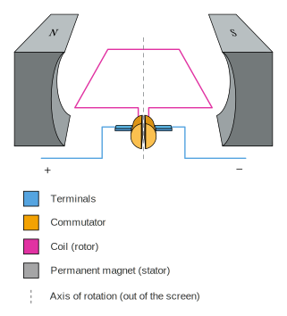
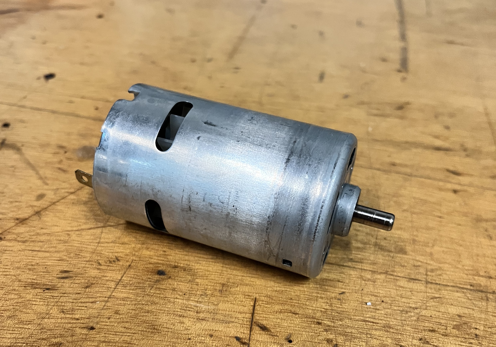
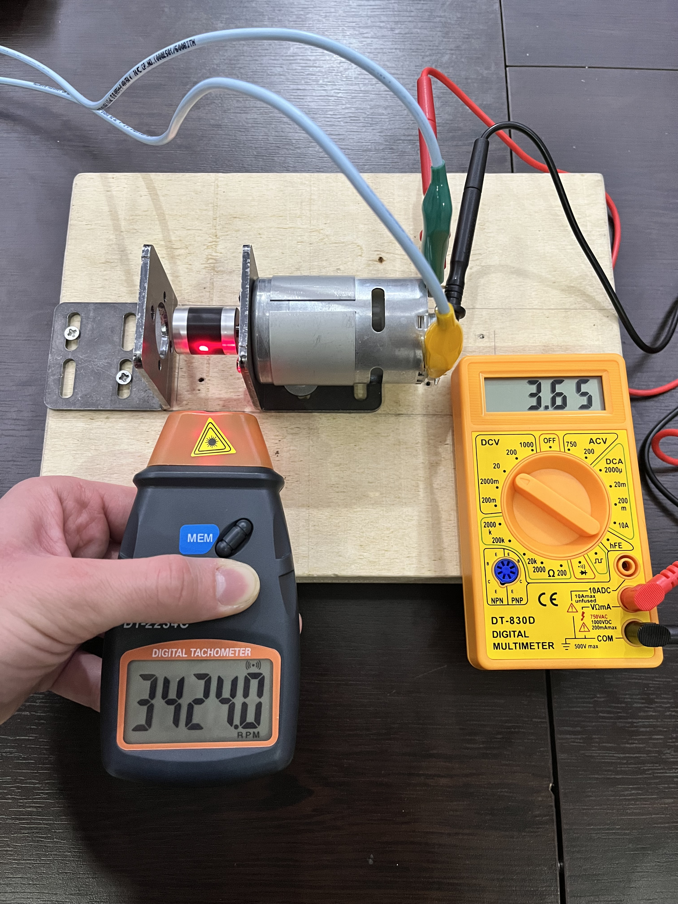
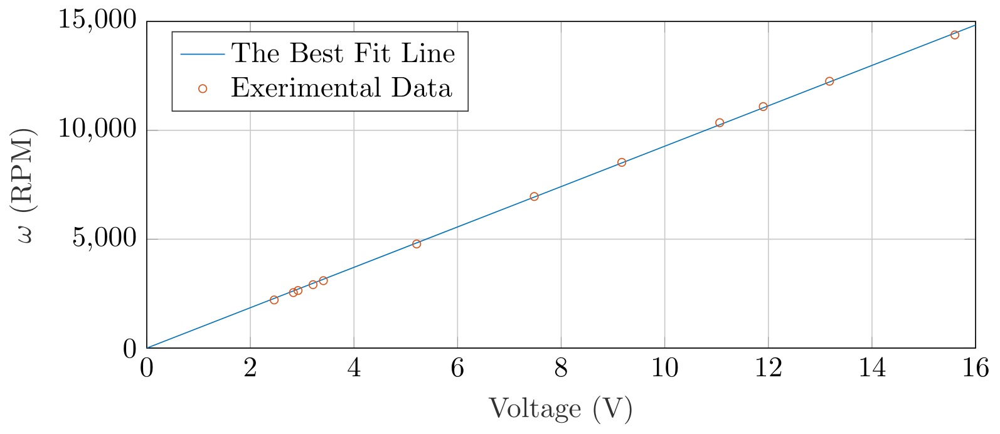
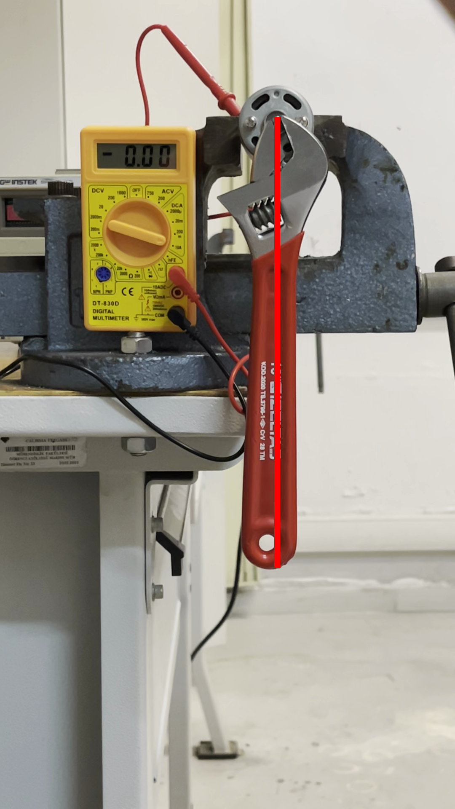
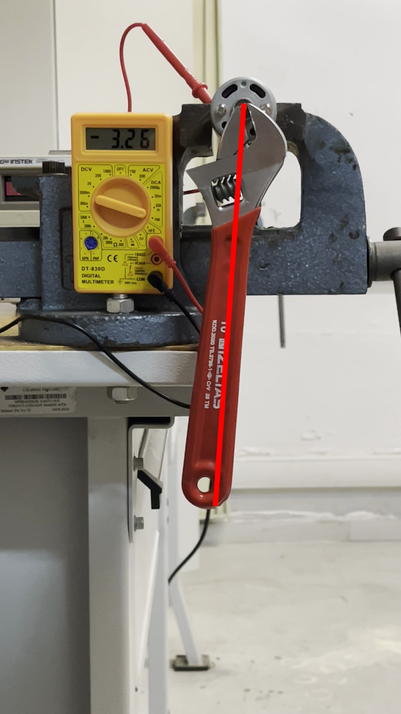
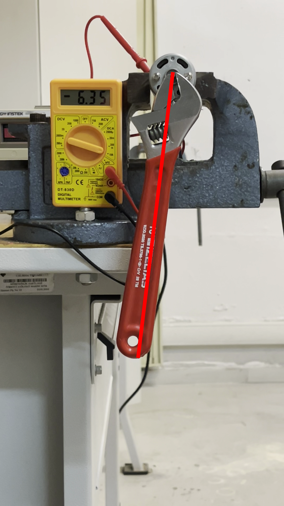
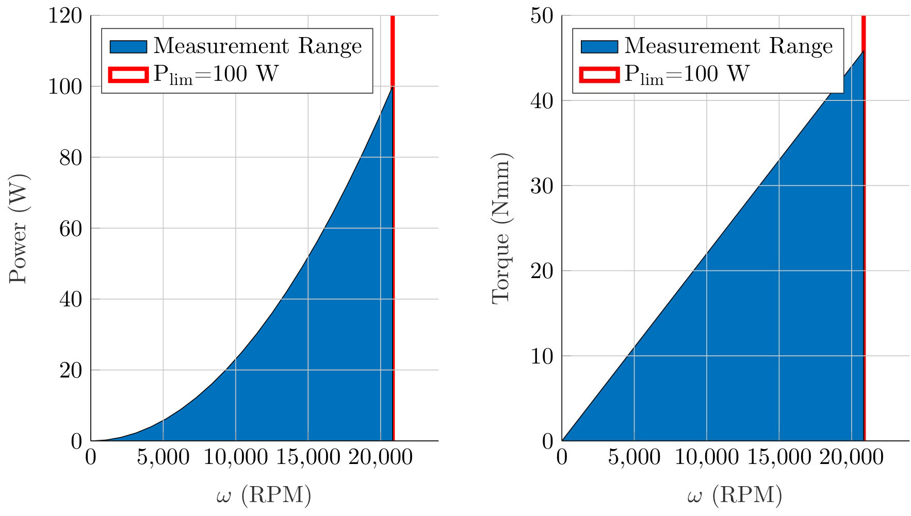
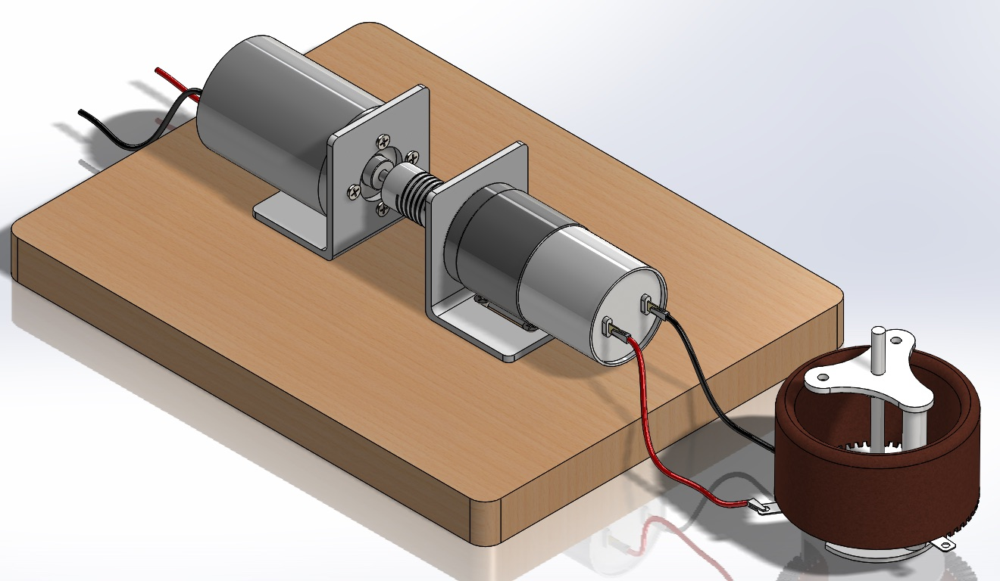
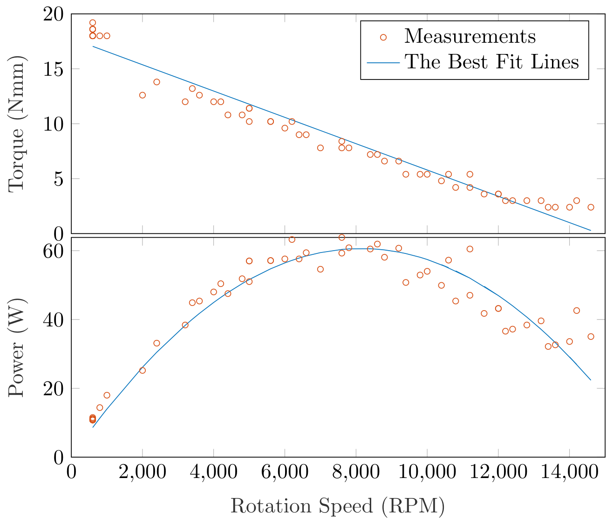

---
date:
  created: 2023-01-10
authors:
  - sinaatalay
---

# Design and Construction of a Dynamometer

This post discusses the process of designing and constructing an absorption dynamometer for small, high-speed, low-torque motors in detail.<!-- more --> The project was the senior design project of three mechanical engineering students at Boğaziçi University: Sina Atalay, Arda Gençgel, and Hümeyra Kayadibi.

Dynamometers and their use cases are summarized. General specifications of the project are given. The available absorption unit designs are discussed, and the decision behind the dynamic braking system is explained. Then, the system is modeled with the state-space method, and the design variables are adjusted to achieve our targets bound to our constraints. The system is simulated with MATLAB, and the code is [published on GitHub](https://github.com/sinaatalay/DynamometerSimulation). The final assembly of the dynamometer is shown along with measurement examples.

## Introduction

There are two types of dynamometers.

1. Absorption Dynamometer
2. Motoring Dynamometer

An absorption dynamometer is a device that measures the instantaneous rotational speed and torque of an engine, motor, or any rotating prime mover while acting as a load.

A motoring dynamometer is a device that measures the required rotational speed and torque to operate a driven device (such as a pump) while acting as a prime mover.

This post covers an absorption dynamometer design, which is referred to as the dynamometer throughout the post.

Before using a motor in real systems, it is essential to analyze its characteristics. A dynamometer is a helpful tool that enables accurate comparison of a motor's performance with other options. Motor suppliers typically provide torque vs. speed, power, and current curves, but they may not always be reliable. Moreover, the specifications of old motors may be unknown. With a dynamometer, however, the necessary measurements can be made to determine any motor's characteristics.

### General Specifications

A low-cost small dynamometer was needed in the engineering labs of Boğaziçi University. The dynamometer was expected to operate for electric motors without reduction drives (high-speed, low-torque motors).

The general specifications given by our advisor were as follows:

- The dynamometer should be able to operate at speed and power up to 20000 RPM and 80 W.
- The dynamometer's maximum torque measurement capability for a given input speed should be specified.

In general, four questions were answered to design the dynamometer.

1.  What type of absorption unit will be used?

    Measuring power implies the dissipation of energy. Therefore, the test motor's[^test-motor] energy output should be somehow absorbed in the dynamometer for measurement.

2.  What device will be used for torque measurement?
3.  What device will be used for rotation speed measurement?
4.  Will the speed, torque, or both be controlled?

    Generally, dynamometers are used to learn about a motor's performance at different speeds. Thus, the user may need to control the speed, the torque, or both.

[^test-motor]: The motor that is being tested.

### Absorption Unit Selection

Dynamometers operate by applying a load (braking) to the test motor. Applying a load to a rotating device results in energy dissipation, as shown in [Equation 1](#eq-heatDissipation).

$$
\begin{equation}
\text{Power} = (\text{Torque}) \cdot (\text{Rotation Speed})
\end{equation}
$$
{ #eq-heatDissipation }

Dynamometers accomplish braking by using various methods to absorb the energy output. The energy can be absorbed with mechanical friction brakes, hydraulic brakes, eddy current brakes, etc. Another method is to use a second DC motor, the load motor[^load-motor], and couple it with the test motor so that dynamic brake can be applied and energy can be absorbed.

[^load-motor]: Another DC motor that is used as a generator in the dynamometer.

This type of dynamometer is generally called an electric dynamometer[@Pulkrabek1997], and this post covers its design.

Before the decision, the available methods are researched and discussed. Then, the decision is made considering the limitations of our time, money, technology, and design criteria. This section briefly explains some types of absorption units and the reasoning behind the decision to use an electric dynamometer.

#### Mechanical Friction Brake

Some dynamometers absorb energy in a mechanical friction brake. The easiest way to build a dynamometer with this method is to use a prony brake[^prony-brake], as illustrated in [@PronyBrakeSchematic]. A prony brake can both absorb the test motor’s energy output and measure the generated torque. Moreover, it is a very simple device to build.

{width=100% #fig-pronyBrake}

As shown in , a lever is clamped to the shaft, and the load F is measured. The load F is only carried by the frictional force between the shaft and the lever since the lever is only supported by the shaft and the load F. Then, the generated torque can be found using statics, as shown in [Equation 2](#eq-torque).

$$
\begin{equation}
\text{Torque} = Fl
\end{equation}
$$
{ #eq-torque }

where $l$ is the distance between the point where load $F$ is applied and the center of the motor's shaft.

There are two primary methods to measure $F$, using a weight or a load cell. An implementation of a prony brake dynamometer with a load cell is shown in [@PronyBrakeYoutube].

{width=60% #fig-pronyBrakeOnYoutube}

Even though a prony brake is an affordable and fast-to-build device, it is hard to control the load or the speed. Either the weights or the clamping force must be changed to control the load, and both are very hard to control electronically. Another disadvantage is that frictional braking causes brake pad wear, so a regular replacement might be required.

[^prony-brake]: The prony brake is a type of friction brake invented by Gaspard de Prony in 1821[@PronyBrakeHistory]

#### Eddy Current Brake

When a piece of metal moves through a magnetic field, circulating currents called eddy currents are generated in the metal. According to Lenz’s law, the generated eddy currents create opposing magnetic fields, which gives rise to a repulsive force that resists the motion of the metal[@Serway2014]. Many braking systems make use of this phenomenon.

In its simplest form, an eddy current dynamometer uses a metal disk attached to a shaft and a magnetic field of controlled strength, as shown in [@EddyCurrentBrakeSchematic]. Eddy currents are induced in the rotating disk, which results in braking. The strength of braking depends on the magnitude of the magnetic field. The magnetic field’s magnitude can be adjusted by moving magnets or increasing the current passing through electromagnets. The energy generated by the test motor is dissipated as heat since the eddy currents flow through an electrical resistance (disk).

{width=60% #fig-eddyCurrentDiagram}

Although eddy current braking allows for controllable braking, accurately measuring torque is difficult. Additionally, designing a well-balanced disk to couple with a high-speed rotating shaft has mechanical challenges.

#### Dynamic Brake

When an electric motor is used as a generator (a load motor) to produce opposing torque that resists the motion, it is called dynamic braking. Electric dynamometers use dynamic braking to apply load to the test motors. In an electric dynamometer, the test motor’s shaft is coupled to a generator so that the test motor’s energy is absorbed with electrical output from the generator. The generated electrical power can be dissipated as heat with a resistor or returned to the supply line. One of the most used types of dynamometers is an electric dynamometer.

This type of dynamometer offers many advantages, like

- A DC motor is a very accessible device and is ready to operate as a generator.
- A dynamic braking system’s lifespan is longer than a frictional braking system’s since there is no wear problem.
- Suppose a DC motor is used as a generator. In that case, the torque can be easily calculated by measuring the current flow through the generator since DC motors exhibit a linear relationship between torque and current.
- The load can be easily changed by adjusting the electrical resistance connected to the generator's output.
- The dynamometer could be further improved to turn the absorbed energy into useful work that would otherwise be lost as heat.
- The absorber dynamometer might be modified to operate in reverse as a motoring dynamometer.

The main disadvantage of dynamic braking is that the braking torque is linearly proportional to the rotation speed. Therefore, it is not possible to brake the test motor at low speeds. The details will be discussed in [Theory Section](#theory).

#### The Decision

Considering our time and equipment limitations, the eddy current brake option was rejected. It was the hardest one to build and maintain among our choices, and it did not offer advantages that the others could not.

We collected more detailed information about prony brakes and dynamic brakes. Then, we found and reviewed their implementations on the internet. Ultimately, we chose the dynamic brake and constructed an electric dynamometer. Its advantages, like being very easy to use, electronically controllable, and open to further modifications, made this option more beneficial than a prony brake dynamometer.

## Theory

In electric dynamometers, an electric motor (a load motor) is used as a generator to apply a load to the test motor. To understand how a load motor can generate a torque that resists the rotating motion, we should look into the basics of a DC motor.

### The Basics of a DC Motor

A basic DC motor model is shown in [@DCMotorSchematic]. There are two fundamental principles of a DC motor.

{width=80% #fig-DCMotor}

**The first principle:** Faraday's law of induction states that as the coil rotates, the changing magnetic flux induces a voltage difference between terminals[@Serway2014]. This voltage difference is called the electromotive force (EMF) and is shown in [Equation 3](#eq-EMF).

$$
\begin{equation}
V=K_V\omega
\end{equation}
$$
{ #eq-EMF }

where $K_V$ is the EMF constant of the motor, $\omega$ is the angular speed of the shaft, and $V$ is the induced voltage difference between terminals[@Nise2019].

**The second principle:** When a current is run through the coil, a magnetic torque is exerted on the rotor. The generated torque can be shown as

$$
\begin{equation}
T=K_T i
\end{equation}
$$
{ #eq-torquevsi }

where $K_T$ is the torque constant of the motor, $i$ is the coil current, and $T$ is the generated torque[@Nise2019].

**The result:** When a DC motor's rotor starts being rotated, it generates EMF, and when the motor's terminals are connected, this EMF causes a current to flow. This current, in turn, generates a torque that resists motion according to Lenz's Law[@Serway2014]. The dynamometer's load motor will operate on this fundamental principle.

### Formulation and Design Variables

To further analyze and optimize the dynamometer's design, the dynamometer is modeled, and its schematic is shown in .

{width=80% #fig-schematic}

When the test motor starts to rotate, the load motor will rotate. This rotation will generate a voltage difference between the load motor's terminals according to [Equation 3](#eq-EMF), and current $i_l$ will start to flow according to [Equation 4](#eq-torquevsi). The current $i_l$ will cause braking.

A voltmeter and amperemeter will be used for the speed and torque measurements, as shown in . The torque and speed can be calculated using [Equation 3](#eq-EMF) and [Equation 4](#eq-torquevsi). However, $K_{V,l}$ and $K_{T,l}$ need to be known for the calculations. Acquiring $K_{V,l}$ and $K_{T,l}$ is discussed in [Load Motor Selection Section](#load-motor-selection).

All the symbols shown in  are described in .

Table: The descriptions of the symbols. { #tbl-symbols }

| Symbol        | Description                               |
| ------------- | ----------------------------------------- |
| $V$           | Measurement of the voltage sensor         |
| $i_l$         | Measurement of the current sensor         |
| $\omega$      | Anguar velocity                           |
| $T$           | Torque                                    |
| $R$           | The potentiometer's resistance            |
| $V_\text{in}$ | The test motor's voltage input            |
| $R_t$         | Internal resistance of the test motor     |
| $L_t$         | Internal inductance of the test motor     |
| $K_{V,t}$     | Back EMF constant of the test motor       |
| $K_{T,t}$     | Torque constant of the test motor         |
| $i_t$         | Current that flows through the test motor |
| $R_l$         | Internal resistance of the load motor     |
| $L_l$         | Internal inductance of the load motor     |
| $K_{V,l}$     | Back EMF constant of the load motor       |
| $K_{T,l}$     | Torque constant of the load motor         |
| $i_l$         | Current that flows through the load motor |

The fundamental independent **design variables** are

- $K_{V,l}$, $K_\text{T,l}$, $L_l$, $R_l$: the load motor selection
- $R$: the potentiometer selection

We will analyze the system to choose the best design variables to achieve the design targets.

### Steady State Analysis and Measurement Range

The selected load motor and the potentiometer range will determine the dynamometer's measurement range. To find the range, we will assume that the system is in a steady state ($\dot{i}_l=0$) so that inductances will not affect the equations. Using Kirchhoff’s voltage law[@Nilsson2014] and [Equation 3](#eq-EMF), it can be shown that

$$
\begin{equation}
i_l(R_l+R)-K_{V,l}\omega=0
\end{equation}
$$
{ #eq-selectionOne }

Next, using [Equation 4](#eq-torquevsi) for the load motor yields

$$
\begin{equation}
i_l=\frac{T}{K_{T,l}}
\end{equation}
$$
{ #eq-selectionTwo }

Combining [Equation 5](#eq-selectionOne) and [Equation 6](#eq-selectionTwo) yields

$$
\begin{equation}
T(R,\, \omega)=\frac{\omega K_{T,l} K_{V,l}}{R+R_l}
\end{equation}
$$
{ #eq-selectionThree }

Moreover, combining $\text{Power}=\text{(Torque)}\cdot\text{(Rotation Speed)}$ and [Equation 7](#eq-selectionThree) yields

$$
\begin{equation}
P(R,\, \omega)=\frac{\omega^2 K_{T,l} K_{V,l}}{R+R_l}
\end{equation}
$$
{ #eq-selectionFour }

where P is the power.

[Equation 7](#eq-selectionThree) and [Equation 8](#eq-selectionFour) show two essential points about electric dynamometers:

1. As $R+R_l$ approaches 0, $T$ approaches to $\infty$. This practically means it would be impossible to rotate the load motor's shaft if $R+R_l$ was equal to 0. However, $R+R_l\neq0$ and its value will set the maximum braking torque for a given $\omega$ value.
2. As $\omega$ decreases, $T$ and $P$ decreases. Therefore, measuring low-speed, high-torque motors with electric dynamometers is very difficult without using gear reducers.

The other criterion that would limit the measurement range is the power absorption limit. In our design, the power generated by the test motor is dissipated as heat by resistors $R$ and $R_l$. There is a limit to how much power these resistors can dissipate as heat before burning out. This power dissipation limit will be denoted as $P_\text{lim}$.

$$
\begin{equation}
\frac{\omega^2 K_{T,l} K_{V,l}}{R+R_l}<P_\text{lim}
\end{equation}
$$
{ #eq-selectionFive }

[Equation 7](#eq-selectionThree), [Equation 8](#eq-selectionFour), and [Equation 9](#eq-selectionFive) will give us the measurement range of the dynamometer. The load motor should be selected so that the design criteria are satisfied.

### Transient State Analysis

In [Steady State Analysis and Measurement Range Section](#steady-state-analysis-and-measurement-range), we assumed that the system is in a steady state so that the internal inductance of the motors will not affect the equations. However, the transient state is critical too, because the dynamometer's response time to change in the potentiometer's resistance may be consequential. The long response times might reduce the ease of use of the dynamometer.

 should be examined closely to model the dynamometer mathematically. The system's mathematical model is constructed using fundamental principles to simulate the system.

Using Kirchhoff's voltage law and [Equation 3](#eq-EMF), it can be shown that

$$
\begin{equation}
V_\text{in}-R_t i_t - L_t \dot{i}_ t - \omega K_\text{V,t}=0
\end{equation}
$$
{ #eq-testmotor }

$$
\begin{equation}
(R+R_l)i_l-L_l\dot{i}_l-\omega K _\text{V,l}=0
\end{equation}
$$
{ #eq-loadmotor }

Then, assuming both of the motors have effective rotational inertia of $I$ and viscous damping of $c$, the torque balance equation with [Equation 4](#eq-torquevsi) yields

$$
\begin{equation}
i_tK_\text{T,t}-I\dot{\omega}-c\omega-i_l K_\text{T,l}=0
\end{equation}
$$
{ #eq-force }

Combining [Equation 10](#eq-testmotor), [Equation 11](#eq-loadmotor), and [Equation 12](#eq-force) and representing them in state-space formulation results

$$
\begin{equation}
\begin{bmatrix}
\dot{i _ t } \\\\
\dot{\omega} \\\\
\dot{i _ l } 
\end{bmatrix}
=
\begin{bmatrix}
{-R} _ t/L _ t & {-K} _ \text{V,t}/L _ t & 0 \\\\
K _ \text{T,t} /I & -c/I & -{nK} _ {T,l} /I \\\\
0 & {nK} _ \text{V,l} /L _ l & (-R(t)-R _ l)/L _ l
\end{bmatrix}
\begin{bmatrix}
i_t \\\\
\omega
\\\\ i_l
\end{bmatrix}
+ 
\begin{bmatrix} 1/L_ t \\\\ 0\\\\ 0 \end{bmatrix}
\begin{bmatrix} V_ {\text{in}}  \end{bmatrix}
\end{equation}
$$
{ #eq-model }

The dynamometer can be simulated with a computational tool by solving [Equation 13](#eq-model). A MATLAB code is written to solve [Equation 13](#eq-model) and simulate the dynamometer. The code is published on GitHub and can be found [here](https://github.com/sinaatalay/DynamometerSimulation). 

## Load Motor Selection

The most crucial part of an electric dynamometer design is selecting the load motor. The load motor will determine $K_{V,l}$, $K_{T,l}$, and $R_{l}$, which determines the measurement range of the dynamometer as demonstrated in [Equation 7](#eq-selectionThree), [Equation 8](#eq-selectionFour), and [Equation 9](#eq-selectionFive).

Considering our operation limitations discussed in [General Specifications Section](#general-specifications) (maximum speed of 20000 RPM and power of 80 W), we looked for a DC motor in local shops. We specifically searched for DC motors with cooling fans, as the energy output of the test motor will be dissipated as heat in the load motor circuit. In the end, we found and bought an old motor without any specifications, shown in .

{width=60% #fig-loadMotor}

The only way to find out if this motor was suitable to our design was to measure $K_{V,l}$, $K_{T,l}$, and $R_{l}$ and use the relevant equations to calculate the measurement range. The selected load motor turned out to be a good choice for our design, and the way the measurements were made and the results are explained in the following sections.

### EMF Constant Measurement

As explained in [The Basics of a DC Motor Section](#the-basics-of-a-dc-motor) and [Equation 3](#eq-EMF), the voltage difference between a DC motor’s terminals is linearly proportional to its speed by EMF constant, $K_{V,l}$.

To find $K_{V,l}$, we supplied different voltages to the motor and measured the corresponding rotation speed, as shown in .  shows the values obtained from the measurements.

{width=60% #fig-kvlMeasurement}

Table: Data table for EMF constant measurement. { #tbl-EMFTest }

| Voltage (V) | $\omega$ (RPM) |
| ----------- | -------------- |
| 2.46        | 2210           |
| 2.83        | 2548           |
| 2.92        | 2642           |
| 3.21        | 2912           |
| 3.41        | 3095           |
| 5.21        | 4781           |
| 7.48        | 6960           |
| 9.17        | 8529           |
| 11.06       | 10350          |
| 11.90       | 11091          |
| 13.18       | 12253          |
| 15.60       | 14380          |

Then, the data fitted with [Equation 3](#eq-EMF). The data points and regression line are plotted in . $K_{V,l}$ turned out to be 0.0103 (V·s)/rad.

{width=80% #fig-EMFTest}

### Torque Constant Measurement

Similarly, the current that flows through a DC motor is linearly proportional to the torque it applies by torque constant, $K_{T,l}$, as shown in [Equation 4](#eq-torquevsi).

We supplied different currents to the motor and measured the corresponding torque. However, measuring the torque was more complex than measuring the speed. First, we attached a lightweight tool to the shaft and then powered the motor. We picked the tool so that the motor could not lift it all the way up but could displace it at a measurable angle. Then, for each current supply, we measured the angular displacement of the tool, as seen in , , and . Next, we located the center of mass of the tool and weighed it with a precision scale. Finally, we calculated the torque with the angle data using statics.

{ width=50%  #fig-angularDisplacementOne }

{ width=50% #fig-angularDisplacementTwo }

{ width=50% #fig-angularDisplacementThree }

 shows the values obtained from the measurements and calculated torque values. The data fitted with [Equation 4](#eq-torquevsi). The data points and regression line are plotted in . $K_{T,l}$ turned out to be 0.00840 (N·m)/A.

Table: Data table for torque constant measurement. { #tbl-torqueTest }

| Current (A) | Torque (Nmm) |
| ----------- | ------------ |
| 3.73        | 33.9         |
| 5.95        | 49.9         |
| 6.09        | 48.7         |
| 6.15        | 48.8         |
| 1.11        | 8.4          |
| 1.32        | 9.9          |
| 3.49        | 31.5         |
| 3.43        | 30.9         |
| 4.24        | 31.2         |
| 4.31        | 31.3         |
| 4.59        | 42.1         |
| 5.49        | 49.8         |
| 6.15        | 52.2         |
| 6.35        | 54.1         |

{width=80% #fig-torqueTest}

### Internal Resistance Measurement

Measuring the internal resistance of a DC motor is an effortless task. The only thing to do is power up the motor, stop the shaft with an external tool, and divide the voltage difference between its terminals by the current flows. That would give the motor's internal resistance because the armature won't contribute the voltage difference between its terminals since $\omega=0$. So, the only contribution comes from internal resistance. The result turned out to be $R_l=8.75\, \mathrm{V}/2.13 \, \mathrm{A}=4.11 \,\Omega$.

### Measurement Range

Since all the required parameters are calculated for the load motor, the dynamometer's measurement range can be calculated (i.e., operation range).

As shown in [Equation 7](#eq-selectionThree) and [Equation 8](#eq-selectionFour), the power and torque are functions of $R$ and $\omega$.

These equations will set the maximum torque and power measurement for a given rotation speed. The maximum torque and power measurement are achieved when $R=0$. Note that $R$ can be increased up to $\infty$, which corresponds to disconnecting the terminals of the load motor.

$$
\begin{equation}
T_{\text{max}}(\omega)=\frac{\omega K_{T,l} K_{V,l}}{R_l}
\end{equation}
$$
{ #eq-maxTorque }

$$
\begin{equation}
P_{\text{max}}(\omega)=\frac{\omega^2 K_{T,l} K_{V,l}}{R_l}
\end{equation}
$$
{ #eq-maxPower }

[Equation 14](#eq-maxTorque), [Equation 15](#eq-maxPower), and power limit $P_\text{lim}=100\, \mathrm{W}$ are graphed in . The blue region shows the dynamometer's measurement range (i.e., operation range).

{width=80% #fig-measurementRange}

The results show that the dynamometer can operate at speed and power up to 20000 RPM and 80 W. So, this load motor is suitable for the design and selection. However, it should be noted that the maximum braking torque will get lower as the rotation speed decreases. Consequently, this design is only suitable for high-speed, low-torque motors. However, a gear reducer may be used to reduce the torque and increase the speed of any motor so that the dynamometer can be used.

### Uncertainty Analysis

Uncertainty of the dynamometer's measurements depends on the accuracy of the voltage sensor, current sensor, $K_{V,l}$, $K_{V,t}$, and $R_{l}$. The torque and rotation speed can be calculated from the voltage and current sensor values with the equations below.

$$
\begin{equation}
\omega=\frac{V+i_lR_l}{K_{V,l}}
\end{equation}
$$
{ #eq-speedCalculation }

$$
\begin{equation}
T=K_{T,l}i_l
\end{equation}
$$
{ #eq-torqueCalculation }

The uncertainties of $K_{V,l}$, $K_{V,t}$, $R_{l}$, $V$, and $i_l$ will contribute the combined uncertainty of $\omega$ and $T$. Recall that the most probable estimate of the combined certainty of a quantity $A$ that depends on $x_1, \cdots, x_n$ is given as

$$
\begin{equation}
U_A=\sqrt{\left(\left.\frac{\partial A}{\partial x_1}\right| _ {x=\overline{x}} U_{x_1}\right)^2 + \left(\left.\frac{\partial A}{\partial x _ 2}\right| _ {x=\overline{x}} U _ {x_2}\right)^2 + \cdots + \left(\left.\frac{\partial A}{\partial x_n}\right|_{x_n=\overline{x}} U _ {x_n}\right)^2 }
\end{equation}
$$
{ #eq-uncertainty }

where $\overline{x}$ and $U_{x_i}$ are the average values of $x_i$s and the uncertainty of $x_i$ respectively[@Leito2020].

Using [Equation 18](#eq-uncertainty) for $T$ and $\omega$ measuremets yields

$$
\begin{equation}
    \begin{split}
        U_\omega&=\sqrt{\left(\frac{1}{K_{V,l}}U_V\right)^2+\left(\frac{R_l}{K_{V,l}}U_{i_l}\right)^2+\left(\frac{\overline{i_l}}{K_{V,l}}U_{R_l}\right)^2+\left(\frac{\overline{V}+\overline{i_l}R_l}{K_{V,l}^2}U_{K_{V,l}}\right)^2} \\\\
        &=206.13\,\text{RPM}
    \end{split}
\end{equation}
$$
{ #eq-omegaUncertainty }

$$
\begin{equation}
    \begin{split}
        U_T&=\sqrt{\left(K_{T,l} U_{i_l}\right)^2+\left(\overline{i_l} U_{K_{T,l}}\right)^2} \\\\
        &=1.51\,\mathrm{N}\cdot\mathrm{mm}
    \end{split}
\end{equation}
$$
{ #eq-TUncertainty }

where $\overline{i_l}$ and $\overline{V}$ are assumed to be equal to 2.5 A and 5 V respectively. Uncertainties of $K_{V,l}$ and $K_{V,t}$ values are calculated with the equations below.

$$
\begin{equation}
    \begin{split}
        U_{K_{V,l}}&=\frac{\sum\limits^{n} _ {n=1} \left|V_n/\omega_n-K _ {V,l}\right|}{n} \\\\
        &=0.0001\,\mathrm{V}\cdot\mathrm{s}/\mathrm{rad}
    \end{split}
\end{equation}
$$
{ #eq-kvlUncertainty }

$$
\begin{equation}
    \begin{split}
        U_{K _ {T,l}}&=\frac{\sum\limits^{n} _ {n=1} \left|T_n/i_n-K_{T,l}\right|}{n} \\\\
        &=0.00006\,\mathrm{N}\cdot\mathrm{m}/\mathrm{A}
    \end{split}
\end{equation}
$$
{ #eq-ktlUncertainty }

The other uncertainties are taken from the measurement devices' uncertainty values and given in .

Table: Uncertainties of the voltage sensor, current sensor, and the internal resistance of the load motor.  { #tbl-uncertanties }

| Variable | Uncertainty |
| -------- | ----------- |
| $V$      | 0.01 V      |
| $i_l$    | 0.01 A      |
| $R_l$    | 0.01 Ω      |

The uncertainties found in [Equation 19](#eq-omegaUncertainty) and [Equation 20](#eq-TUncertainty) will be the precision of the dynamometer.

## Building the Dynamometer

After the load motor selection, the theoretical measurement range is found. The next step is building the dynamometer with an electronic circuit that measures the voltages and currents in the load motor so that the torque and rotation speed can be calculated. This section summarizes the general working mechanism of the dynamometer, as well as the mechanical and electronic designs.

### Working Mechanism and Flowchart

The dynamometer is shown in block diagram form in .

{width=85% #fig-blockDiagram}

The load and speed will be controlled by changing the resistance of the potentiometer ($R$). The user can easily adjust the potentiometer's resistance. The resistance value will change the braking load and speed of the motor, as shown in [Equation 7](#eq-selectionThree) and [Equation 8](#eq-selectionFour). While the user changes the resistance, the electronic circuit will collect the measurement data continuously.

A potentiometer is a very accessible tool, and we bought one from a local shop that can resist up to 100 W with a resistance range from 0 to 80 Ω. It was a suitable choice considering the power limit set by the design criteria.

### Mechanical Design and Components

Before the electronic measurement circuit, a mechanical design is made, and the dynamometer with two DC motors (a test and a load motor) is assembled. The final product and its 3D CAD model are shown in  and .

{width=60% #fig-finalRealDyno}

{width=60% #fig-dynamometerCAD}

The assembly consists of the following components:

- A wooden block acts as a base on which the mechanical system is placed.
- Two DC motor mounts for the load and test motors.
- A flexible coupling to connect the shaft of the test motor to the load motor.
- A potentiometer to control the braking torque.

The mechanical assembly of the dynamometer was straightforward, and the process is explained below.

1. The motor mounts are placed on the wooden base and fastened using screws.

2. Motors are fastened to the mounts and coupled together.

3. The potentiometer is attached to the load motor.

4. The electronic system is connected to the load motor and the potentiometer.

### Electronic Design and Components

After the mechanical assembly, the next step was to design the electronic circuit and program a microcontroller to make and collect the measurements. The schematic of the final design is given in [Figure 16](#fig-electronicschematic). The main points that were considered are given below.

- A current sensor is needed.
- A voltage sensor is needed.
- An LCD screen needs to be available for users without computers.
- Integration with MATLAB should be possible.
- The results should be as accurate as possible.

<figure style="margin: 1em 0; width: 100%" id="fig-electronicschematic">
  <object data="../../assets/figures/dyno-schematic.pdf" type="application/pdf" width="100%" height="600px">
      <embed src="../../assets/figures/dyno-schematic.pdf" type="application/pdf"/>
  </object>
  <figcaption>Figure 16: The schematic of the electronic circuit of the dynamometer.</figcaption>
</figure>

We used a basic Arduino-like microcontroller, Teensy 3.2[@teensy]. The programming part consisted of 2 main concerns.

1. How to reduce the noise of the sensors?
2. How to integrate with MATLAB?

Both sensors' outputs are sampled 20 times in a second, and then the mean values of the samples are used as measurements to reduce the noise of the sensors. Therefore, the dynamometer collects 1 data per second.

The integration with MATLAB can be made via a USB cable. However, it is not necessary to connect the dynamometer to a computer to use it since there is an LCD screen.

## Results

Eventually, we tested the dynamometer with another DC motor we bought from a local shop. We connected the dynamometer to a computer so the results could be plotted in real-time. The measurement results are shown in [Figure 17](#fig-results).

<figure markdown="span" style="margin: 1em 0; width: 100%" id="fig-results" >
  { width=50% }
  <figcaption>Figure 17: Measurements of the dynamometer.</figcaption>
</figure>

## Conclusions

In this project, an electric absorption dynamometer is designed, modeled, and built. In the end, it successfully measured a motor's power at different speeds.

Firstly, the dynamometers are researched, and their fundamental working principle is analyzed. Then, an absorption unit is selected to be a DC generator. After the absorption unit selection, the dynamometer is formulated carefully, and the necessary components are found and designed to achieve our targets. Next, the system is modeled mathematically to ensure that the components satisfy the design criteria. A MATLAB code was written for the simulation of the dynamometer and made available on GitHub. Finally, the dynamometer is assembled, and the electronic circuit is designed and programmed.

### Possible Future Improvements

The possible future improvement ideas are given below so that in the future, people can further improve the design and make use of it.

1.  The load can be controlled electronically by substituting the potentiometer with a digital potentiometer or using another electric motor to control the potentiometer.
2.  Better sensors can be used to get more precise results.
3.  The torque and back EMF constant measurements can be made with high-precision instruments to make the results more reliable.
4.  The generator's output (load motor) can be used for useful work instead of heat dissipation with the potentiometer.

\bibliography